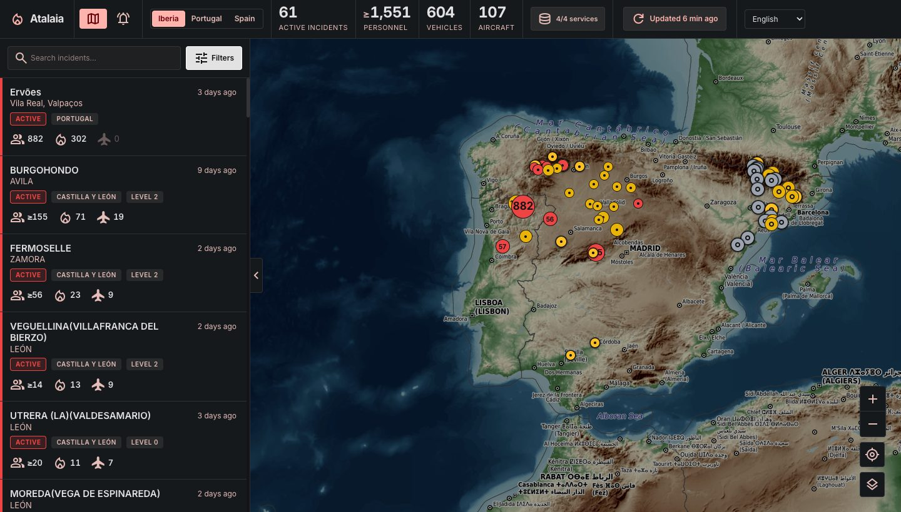

# Atalaia

**Live wildfire map for Portugal and Spain** — built from the civil protection services' own feeds.

**→ [lingelo.github.io/atalaia](https://lingelo.github.io/atalaia/)**



No account, no tracking, no API key. Available in Portuguese, Spanish and English.

## What it shows, and what it refuses to show

Two kinds of data appear on this map, and they are **never** mixed:

| | Operational incidents | Satellite detections |
|---|---|---|
| Source | civil protection services | NASA FIRMS (VIIRS) |
| Meaning | a fire crews are fighting | a thermal anomaly seen from orbit |
| Confirmed on the ground | yes | **no** |
| Drawn as | solid disc, status colour | hollow ember ring |
| Counted in totals | yes | **never** |

A satellite detection is not a fire. VIIRS measures radiated heat during a pass: it can be agricultural burning, a volcano, or an industrial flare. Adding those to a national incident count would compare firefighters with hotspots, so the map keeps them apart by shape, by colour, and in every total. The rings are graded by age, from bright to dark, so you can tell what is burning *now* from what was seen yesterday.

### Coverage is partial, and the map says so

**Portugal** is covered nationally. **Spain is not** — there is no national real-time wildfire service. Three autonomous communities publish usable data; the other fourteen do not.

This matters more than it sounds. An empty area on this map means **"no data"**, never "no fire". A fire in Galicia, Extremadura or Valencia simply will not appear. The interface states this, and a badge reports the live status of each service — because confusing "the service is down" with "nothing is burning" would turn a technical outage into good news.

## Data sources

| Territory | Service | What it publishes |
|---|---|---|
| Portugal | ANEPC, via [fogos.pt](https://fogos.pt) | status, personnel, vehicles, aircraft |
| Andalusia | Plan INFOCA, Junta de Andalucía | status, position, resources by category |
| Catalonia | Bombers de la Generalitat | ongoing operations, to the minute |
| Castile and León | Junta de Castilla y León | burned area, alert level, resources |
| Worldwide | [NASA FIRMS](https://firms.modaps.eosdis.nasa.gov/) (VIIRS) | thermal anomalies, ~142,000 hotspots |

Endpoints, quotas and their pitfalls are documented in [`docs/data-sources.md`](docs/data-sources.md) — each one was found by probing the service, not by reading documentation, because most have none.

### Freshness

Incident data is rebuilt roughly **every 10 minutes** by a scheduled workflow and served as static files. Satellite data is refreshed hourly, since the satellites only pass over every few hours.

The interface always displays the **age of the data itself**, never the time you loaded the page. On a wildfire map, presenting stale information as fresh is the worst possible lie.

## Running locally

Requires Node 24.

```bash
npm ci
npm run build:data   # fetches upstream data into public/data/ (git-ignored)
npm run dev          # http://localhost:5173
```

`build:data` is worth running once: without it, a production build has no dataset to serve. It downloads ~21 MB of NASA CSV, so avoid running it in a loop.

| Command | |
|---|---|
| `npm run dev` | dev server, proxies the upstream APIs |
| `npm run lint` | `tsc --noEmit` |
| `npm run build` | production build |
| `npm run preview` | serve the build locally |
| `npm run build:incidents` | rebuild incidents only (fast) |
| `npm run build:firms` | rebuild satellite detections only |

## How it works

React 19 + TypeScript + Vite, Leaflet for the map, Tailwind 4 for styling. No backend.

The whole architecture follows from one constraint: **neither fogos.pt nor NASA FIRMS sends CORS headers**, so a static site cannot call them from the browser. Data is therefore fetched by a GitHub Actions workflow and published as static JSON alongside the site. In development, the same data is fetched live through a Vite proxy — which means dev and production do not run the same fetching code.

Some deliberate choices worth knowing about:

- **Missing values are never zero.** Some services publish no personnel counts. Those render as a dash, not as `0`, and are excluded from totals rather than dragging them down. A `≥` prefix marks counts known to be incomplete.
- **Status vocabularies are normalised.** Four services describe their states in four different ways; all are mapped to canonical phases so a French or English reader sees consistent labels, with the original always kept alongside.
- **The satellite layer renders on canvas**, with a spatial index and a density surface at wide zooms. At ~142,000 hotspots, one DOM node per marker would collapse the page.

Deployed to GitHub Pages on every push to `main` and on a 10-minute schedule.

## Credits

Map data © [OpenStreetMap](https://www.openstreetmap.org/copyright) contributors. Tiles © [CARTO](https://carto.com/attributions), [OpenTopoMap](https://opentopomap.org/) (CC-BY-SA) and Esri. Active fire data courtesy of NASA FIRMS. Portuguese incident data via [fogos.pt](https://fogos.pt).

Each source remains under its own licence and terms of use.
